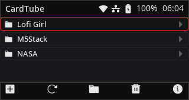
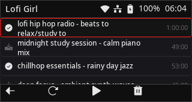
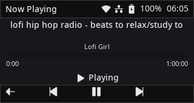

<p align="center">
  
  
  
</p>

<div align="center">
    <h1>CardTube</h1>
</div>

<div align="center">
  <p>A YouTube audio downloader and player for the M5Stack CardputerZero.</p>
</div>

<p align="center" style="margin: 20px 0; display: flex; justify-content: center; flex-wrap: wrap; gap: 12px;">
  
  
  
  
  
</p>

<p align="center">
  <a href="https://discord.gg/ysQAWBUE9Q">
    
  </a>
</p>

## What is CardTube?

CardTube keeps a small library of YouTube channels and lets you listen to them
from your CardputerZero, without a browser and without an account.

Add a channel with a link or an `@handle`, browse its latest uploads, download
the audio you want, and play it on the device. Downloaded tracks are marked in
the list, and the built-in player shows a progress bar with play, pause, seek,
previous and next.

- **Channel library** — follow any YouTube channel; the list is saved between
  launches and kept sorted by name.
- **Download audio** — one press fetches the best audio stream with
  [`yt-dlp`](https://github.com/yt-dlp/yt-dlp). Progress is shown live and each
  row shows whether it is downloaded, downloading, or remote only.
- **Play back on device** — playback is delegated to `mpv` (with
  `ffplay`/`mpg123`/`aplay`/`vlc` fallbacks) through a small JSON‑IPC bridge, so
  the on‑screen player has real progress, pause and seek.
- **Plays the next track automatically** — when a track ends, CardTube starts
  the next one, downloading it first if needed.
- **Works offline** — each channel's latest video list is cached, so channels
  stay browsable and the tracks you downloaded stay playable. Without a
  connection the player only moves between downloaded tracks.
- **Storage manager** — see the number and total size of your downloads, the
  cache size and the free space, and remove tracks on the spot.
- **Dark theme, red accent** — a single, minimal dark UI designed for the
  CardputerZero screen.

> CardTube is an unofficial client. Downloaded audio is subject to YouTube's
> terms of service and the rights of the content owners — only download content
> you are allowed to.

## Screens & controls

| Library (channels) | Videos (selected channel) | Player |
| --- | --- | --- |
|  |  |  |

### Navigation bar

The bottom bar maps the hardware keys `4`–`8` from left to right, and its
actions change with the page:

| Key | Library | Videos | Storage | Player |
| --- | --- | --- | --- | --- |
| `4` | Add channel | Back | Back | Back to videos |
| `5` | Refresh | Refresh | Refresh | Previous track (hold to seek back) |
| `6` | Open channel / now playing | Open player, play or download+play | — | Play / pause |
| `7` | Remove channel | Delete download | Delete download | Next track (hold to seek forward) |
| `8` | Storage & info | — | — | — |

### Keyboard

| Key | Action |
| --- | --- |
| `UP` / `DOWN` | Move the list selection (wraps top↔bottom); on the player, previous / next track |
| `LEFT` / `RIGHT` | Seek 10&nbsp;s on the player |
| `ENTER` | Open a channel, or play / download the highlighted video |
| `DEL` | Remove the highlighted channel or downloaded track (with confirmation) |
| `ESC` / `BKSP` | Back; **hold on the library page to quit** |
| `H` (`Fn`+`H`) | Toggle the keyboard help popup |
| `PRSC` | Save a screenshot to `~/Pictures/Screenshots` |

Channel links are entered through a modal dialog: paste a URL, an `@handle`, a
`UC…` channel id, or a `youtube.com/...` link and press `ENTER`.

## Install on CardputerZero

A Debian package is built for `arm64`. Install it with `apt` so the runtime
tools come along automatically:

```shell
sudo apt install ./CardTube_0.2.2_m5stack1_arm64.deb
```

The package declares `yt-dlp`, `mpv` and `ca-certificates` as dependencies, so
`apt` fetches and installs them during installation (a plain `dpkg -i` cannot
resolve dependencies). It installs:

| Path | Content |
| --- | --- |
| `/usr/bin/cardtube` | Application executable. |
| `/etc/cardtube.conf` | System-default settings. |
| `/usr/share/cardtube/` | Runtime assets: fonts, images, audio. |
| `/usr/share/APPLaunch/applications/cardtube.desktop` | APPLaunch launcher entry. |
| `/usr/share/APPLaunch/share/images/cardtube*.png` | Launcher icons. |
| `/usr/lib/systemd/system/cardtube.service` | Optional autostart service (runs as the non‑root `pi` user). |
| `/usr/share/doc/cardtube/` | README and third-party asset license notes. |

CardTube is submitted to the CardputerZero App Store under the share code
**CTUB**. On desktop the simulator needs `tools/yt-dlp.exe` and a player such as
mpv; on the device these are resolved from `PATH` and the usual install
locations.

### External tools and data

CardTube shells out to `yt-dlp` for listing and downloading and to an external
player for playback (mpv recommended). See [`tools/README.md`](tools/README.md)
for the binary search order and how to bundle them.

Runtime locations:

| Item | Desktop (Windows) | Device (Linux) |
| --- | --- | --- |
| Channels file | `%APPDATA%\cardtube\channels.tsv` | `$XDG_CONFIG_HOME/cardtube/channels.tsv` |
| Downloads | `%LOCALAPPDATA%\cardtube\media` | `$XDG_DATA_HOME/cardtube/media` |
| Video-list cache | `%LOCALAPPDATA%\cardtube\cache` | `$XDG_DATA_HOME/cardtube/cache` |

Override any of them with `CARDTUBE_CONFIG_DIR`, `CARDTUBE_MEDIA_DIR`,
`CARDTUBE_CACHE_DIR`, `CARDTUBE_YTDLP` and `CARDTUBE_PLAYER`. Set
`CARDTUBE_FORCE_OFFLINE=1` to exercise the offline behaviour in the simulator.

The latest video list of every channel is cached, so a channel stays browsable
and playable while offline: opening it shows the saved list immediately with the
downloaded items marked, and only refreshes from the network when a connection
is available. The status bar shows `Offline - showing saved list` when a cached
list is being used.

## Architecture

CardTube uses a small MVVM structure around LVGL:

- **UI layer**: screens and widgets are implemented with LVGL objects.
  `BaseScreen` owns the page root, title bar, nav bar, and page content.
  Widgets derive from `BaseWidgets` and expose a `build()` entry point.
- **Data model**: `BaseModel` stores application state (channels, videos,
  current page, playing item, theme).
- **View model**: `BaseViewModel` exposes model state as LVGL observer subjects
  and provides UI actions such as page switching, downloading, playback and
  storage management. `TubeService` wraps `yt-dlp`, `MediaPlayer` wraps the
  external player.
- **Reactive/data binding**: `src/reactive` wraps LVGL observer subjects and
  common bindings so labels, styles, flags, widget values, and events connect
  to application state.
- **Data flow**: user input triggers widget callbacks, callbacks update
  `BaseViewModel`, the view model publishes subjects, and bound UI objects
  refresh automatically through LVGL observers.
- **Platform layer**: platform code owns Linux input integration, the process
  helper, `yt-dlp`/player discovery (`RuntimePaths`) and other hardware-facing
  services.

The application is **dark-theme only**; the light theme and its toggle were
removed. The `dark_mode` value in `config/cardtube.conf` is still parsed for
compatibility but the app always runs in dark mode.

## Repository Layout

```text
.
├── assets/                 # Runtime assets used by the app
│   ├── audio/              # UI sounds
│   ├── fonts/              # TTF fonts loaded through FreeType
│   └── images/             # App icons and device images
├── screenshots/            # 320x170 store screenshots
├── src/
│   ├── app/                # Application lifecycle, asset loading, screen management
│   ├── config/             # LVGL config headers for desktop and device builds
│   ├── logger/             # Project logging wrapper
│   ├── model/              # Channels, videos, downloads, persistence
│   ├── platform/           # Input, processes, media player, runtime paths
│   ├── reactive/           # LVGL observer subjects and binding helpers
│   ├── view/               # Theme, UI constants, screens, and widgets
│   │   ├── screens/        # Channel, video, player and storage screens
│   │   └── widgets/        # Nav bar, dialogs, toast, list rows
│   ├── viewmodel/          # BaseViewModel, TubeService and playback actions
│   └── main.cpp            # Program entry point
├── CMakeLists.txt          # Build graph, dependencies, options, targets
├── CMakePresets.json       # Desktop/device configure and build presets
├── app-builder.json        # CardputerZero App Store manifest
└── README.md
```

### Modules

- `src/app/asset_manager.*`: resolves runtime assets from the optional CMake asset root, source tree `assets/`, and installed `/usr/share/<APP_NAME>/` path.
- `src/app/screen_manager.*`: switches LVGL screens when the current page subject changes.
- `src/app/desktop_simulator_frame.*`: owns the desktop SDL window, renderer, device shell, input, and LVGL texture composition.
- `src/model/library_store.*`: channel/video cache and downloaded-file discovery (TSV on disk).
- `src/platform/media_player.*`: external player process + mpv JSON‑IPC (position, pause, seek, end-of-file).
- `src/platform/process.*`: non-blocking child-process helper used by yt-dlp and the player.
- `src/platform/runtime_paths.*`: locates `yt-dlp` and the player across env vars, bundled `tools/`, app dirs and `PATH`.
- `src/platform/linux_input.*`: Linux evdev keypad support and desktop SDL keyboard routing.
- `src/viewmodel/tube_service.*`: `yt-dlp` playlist listing and audio download.
- `src/view/screens/*`: channel library, videos, player and storage pages.
- `src/view/widgets/*`: nav bar, dialogs, toast, help popup and list rows.

## Build Options

Common CMake cache options:

| Option | Default | Description |
| --- | --- | --- |
| `USE_DESKTOP` | `ON` | Build SDL desktop simulator when `ON`; build embedded Linux target when `OFF`. |
| `APP_NAME` | `cardtube` | Application name used by installed asset lookup. |
| `APP_ASSETS_ROOT` | empty | Optional runtime asset root. Expected layout includes `fonts/`, `images/`, etc. |
| `APP_CONFIG_FILE` | platform default | Optional config path. Defaults to `config/cardtube.conf` for desktop builds and `/etc/cardtube.conf` for device builds. |
| `APP_KEY_INPUT_DEVICE` | empty | Optional Linux evdev device path, e.g. `/dev/input/event0`. Empty means auto-scan `/dev/input/event*`. |
| `APP_FRAMEBUFFER_DEVICE` | `/dev/fb0` | Linux framebuffer device used by embedded builds when `APP_USE_DRM=OFF`. |
| `APP_USE_DRM` | `OFF` | Use LVGL's Linux DRM/KMS backend instead of fbdev for embedded builds. |
| `APP_DRM_DEVICE` | `/dev/dri/card0` | DRM device path used when `APP_USE_DRM=ON`. |
| `APP_DRM_CONNECTOR_ID` | `-1` | DRM connector id used when `APP_USE_DRM=ON`; `-1` auto-selects. |

Asset lookup order:

1. `APP_ASSETS_ROOT` when provided by CMake
2. source-tree `assets/` for development
3. `/usr/share/<APP_NAME>/` for installed deployments

## Desktop Builds

Desktop builds are intended for fast UI development. LVGL renders at the device-native `320x170` resolution, while SDL composites that texture into a hardware-accelerated, high-DPI simulator window with the full-resolution device shell.

Current dependencies info:

| Dependency | Version | Source | Notes |
| --- | --- | --- | --- |
| LVGL | `v9.5.0` | `CMakeLists.txt` FetchContent | Main GUI framework. |
| fmt | `12.1.0` | System package manager or `vcpkg.json` override | Logging and formatted strings. |
| libpng | `1.6.48` | System package manager or `vcpkg.json` override | PNG image decoding support for LVGL. |
| libjpeg-turbo | `3.1.3` | System package manager or `vcpkg.json` override | JPEG image decoding support for LVGL. |
| zlib | `1.3.1` | System package manager or `vcpkg.json` override | Compression dependency used by image libraries. |
| SDL2 | `2.32.54` | System package manager or `vcpkg.json` override | Desktop simulator display and input backend. |
| FreeType | `2.13.3` | System package manager or `vcpkg.json` override | Runtime TTF font rendering. |

> Windows vcpkg installs use the versions above through manifest mode, with the registry baseline pinned in `vcpkg-configuration.json`.

### Linux Desktop

Debian/Ubuntu dependencies:

```shell
sudo apt update
sudo apt install -y \
  build-essential \
  cmake \
  ninja-build \
  libpng-dev \
  libjpeg-dev \
  libfmt-dev \
  libsdl2-dev \
  libfreetype-dev \
  zlib1g-dev
```

> [!NOTE]
> Minimal CMake version is 3.31.0 (in coordinate with Debian 13 trixie), for Ubuntu user you can install latest cmake via `snap`
> and run following cmake command with `/snap/bin/cmake`.

Configure:

```shell
cmake --preset linux-x86-64
```

Build:

```shell
cmake --build --preset linux-x86-64-dbg
# alternatively, you can run release build
# cmake --build --preset linux-x86-64-rel
```

Run:

```shell
./build/linux-x86-64/Debug/cardtube
# or launch release build
# ./build/linux-x86-64/Release/cardtube
```

### macOS Desktop

Install the Apple command-line tools:

```shell
xcode-select --install
```

Install dependencies with Homebrew:

```shell
brew install \
  cmake \
  ninja \
  libpng \
  jpeg \
  fmt \
  sdl2 \
  freetype \
  dpkg \
  zlib
```

Configure for Apple Silicon:

```shell
cmake --preset darwin-arm64
```

Build:

```shell
cmake --build --preset darwin-arm64-dbg
# alternatively, you can run release build
# cmake --build --preset darwin-arm64-rel
```

Run:

```shell
./build/darwin-arm64/Debug/cardtube
# or launch release build
# ./build/darwin-arm64/Release/cardtube
```

For Intel macOS, use the `darwin-x86-64` configure preset and matching build preset:

```shell
cmake --preset darwin-x86-64
cmake --build --preset darwin-x86-64-dbg
# alternatively, you can run release build
# cmake --build --preset darwin-x86-64-rel
./build/darwin-x86-64/Debug/cardtube
# or launch release build
# ./build/darwin-x86-64/Release/cardtube
```

### Windows Desktop

Install CMake and Ninja:

```powershell
winget install Kitware.CMake
winget install Ninja-build.Ninja
```

Install a C++ toolchain. Choose one of the following.

MSVC Build Tools:

```powershell
winget install Microsoft.VisualStudio.BuildTools
```

In the Visual Studio installer, enable **Desktop development with C++** and make sure MSVC and a Windows SDK are selected.

MinGW-w64:

```powershell
winget install BrechtSanders.WinLibs.POSIX.UCRT
```
Alternatively, you can download from [`winlibs`](https://winlibs.com/).

Install vcpkg:

```powershell
git clone https://github.com/microsoft/vcpkg.git C:\vcpkg
C:\vcpkg\bootstrap-vcpkg.bat -disableMetrics
```

Configure environmental variables for current terminal:

```
$env:VCPKG_ROOT="C:\vcpkg"
$env:PATH="$env:VCPKG_ROOT;$env:PATH"
```

> [!TIP]
> Change `VCPKG_ROOT` to your vcpkg installation directory if it is located elsewhere.
>
> These environment variables are **session-scoped**, meaning they only apply to the current terminal session.
> Once the terminal is closed, the variables will be lost and need to be set again in a new session.
> If you want to persist an environment variable
> ```powershell
> setx VCPKG_ROOT "C:\vcpkg"
> ```

Configure and build with MSVC:

> [!IMPORTANT]
> These steps require launching CMake from a **Developer Command Prompt** or **Developer PowerShell** provided by Visual Studio.
>
> This ensures that the MSVC environment (compiler, linker, and Windows SDK paths) is properly initialized.
>
> Without this environment setup, CMake may fail to detect or correctly configure the MSVC toolchain.

```powershell
cmake --preset win32-msvc
cmake --build --preset win32-msvc-dbg
.\build\msvc\Debug\cardtube.exe

# alternatively for release build
# cmake --build --preset win32-msvc-rel
# .\build\msvc\Release\cardtube.exe
```

Configure and build with MinGW-w64:

> [!IMPORTANT]
> These steps require a properly configured MinGW-w64 toolchain in your system PATH.
>
> Please ensure the following compilers are available in the current terminal session:
> - gcc
> - g++
> - ld
> - ar
>
> You can verify the setup by running:
> ```powershell
> gcc --version
> g++ --version
> ```
>
> If these commands are not recognized, you must add MinGW-w64 `bin` directory to your PATH before configuring CMake.

```powershell
cmake --preset win32-mingw64
cmake --build --preset win32-mingw64-dbg
.\build\mingw64\Debug\cardtube.exe

# alternatively for release build
# cmake --build --preset win32-mingw64-rel
#.\build\mingw64\Release\cardtube.exe
```
> [!NOTE]
> `VCPKG` will handle the dependencies during CMake configuration process automatically,
> this may take several minutes depending on your network connection.

To try the app without a device, drop `yt-dlp.exe` into `tools/` and make sure
mpv is installed; CardTube finds both automatically.

## CardputerZero Cross Build

This preset builds an aarch64 Linux target from a host machine with an `aarch64-linux-gnu-gcc/g++` toolchain.
The BSP at `.cache/sdk_bsp-src` is treated as a sysroot: headers, libraries, startup objects, and pkg-config metadata are resolved from that directory first.
If that directory does not exist on the first configure, the toolchain downloads and extracts `sdk_bsp.tar.gz` automatically before CMake runs compiler checks.

Install a cross compile toolchain:

+ Debian

```shell
sudo apt install crossbuild-essential-arm64
```
+ MacOS

```shell
brew install aarch64-unknown-linux-gnu
```

> [!NOTE]
> On Windows, it's recommended to use WSL for cross build.
> or you can download [cross compile tools](https://sysprogs.com/getfile/2542/raspberry64-gcc14.2.0.exe) and configure the `PATH` yourself.

Configure:

```shell
cmake --preset cp0-cross
```

Build:

```shell
cmake --build --preset cp0-cross-dbg
# or release build
# cmake --build --preset cp0-cross-rel
```

Deploy the release package to your device after filling in your device user and IP:

```shell
REMOTE_USER=<user> REMOTE_HOST=<device-ip> ./deploy.sh
```

By default, the debian package is copied to `$HOME` folder, normally it's under `/home/<user>`.

On your device, install the copied package with `apt`:

```shell
sudo apt install ./CardTube_0.2.2_m5stack1_arm64.deb
```

## Debian Package

Debian packages are produced with CPack and written to `dist/`. The package file name follows:

```text
<AppName>_<Version>_m5stack1_arm64.deb
```

Default example:

```text
dist/CardTube_0.2.2_m5stack1_arm64.deb
```

Build and package:

```shell
cmake --preset cp0-cross
cmake --build --preset cp0-cross-rel
cpack --preset cp0-cross-deb
```

Or run the full configure, release build, and package flow with one workflow preset:

```shell
cmake --workflow --preset cp0-cross-package
```

> [!NOTE]
> Use a Debian based Linux host with the CPack generator
> as other OS may not resolve the dependencies correctly
> (no full dpkg, dpkg-shlibdeps, objdump and readelf support).

## Development Guide

### Adding a Screen

1. Add a new page enum value in `src/model/base_model.h`.
2. Add the page transition/state logic in `BaseModel` and `BaseViewModel`.
3. Create a screen under `src/view/screens/` deriving from `BaseScreen`.
4. Extend `ScreenManager` to load the new screen when the page subject changes.
5. Update `NavBar` icons and callbacks as needed.

### Adding a Widget

1. Derive from `BaseWidgets`.
2. Implement `build()` and create LVGL objects under `parent_`.
3. Use `reactive::bind_*` helpers for text, style, state, or event bindings.
4. Keep LVGL observer lifetimes object-bound whenever possible with `lv_subject_add_observer_obj` or `reactive::observe_obj`.

### Fonts and Assets

Device builds prefer Noto Sans CJK Medium/Regular for the default bold and regular
text. They are loaded through FreeType from:

```text
/usr/share/fonts/opentype/noto/NotoSansCJK-Medium.ttc
/usr/share/fonts/opentype/noto/NotoSansCJK-Regular.ttc
```

Desktop builds use the bundled `NotoSans-Medium.ttf` / `NotoSans-Regular.ttf`
(SIL OFL, in `assets/fonts/`), and device builds fall back to them when the
system CJK font is missing. The bundled Noto Sans covers Latin, Greek and
Cyrillic, so non-Latin channel and video names render correctly in the
simulator. When no bundled font is found, the UI falls back to LVGL's built-in
Montserrat fonts (Latin only). Runtime icon and other asset fonts remain under:

```text
assets/fonts/
/usr/share/<APP_NAME>/fonts/
```

You can also provide an asset root at configure time:

```shell
cmake --preset darwin-arm64 -DAPP_ASSETS_ROOT=/path/to/assets
```

## Publishing to the App Store

The store listing lives in [`app-builder.json`](app-builder.json) (title,
summary, description, category, screenshots, icon, license, author, share code
and permissions). Submissions use M5Stack's
[`CardputerZero/AppBuilder`](https://github.com/CardputerZero/AppBuilder)
tooling:

```shell
./czdev login                                   # one-time GitHub device-flow login
./czdev publish --deb dist/CardTube_0.2.2_m5stack1_arm64.deb
```

Store screenshots are the `320x170` PNGs in [`screenshots/`](screenshots); the
store icon is `assets/images/cardtube.png`.

# Contributing

If you have better framework designs on Embedded Linux or build system practice, feel free to let us know.

# License

Project released under MIT license. More license information can be found in assets folder.
